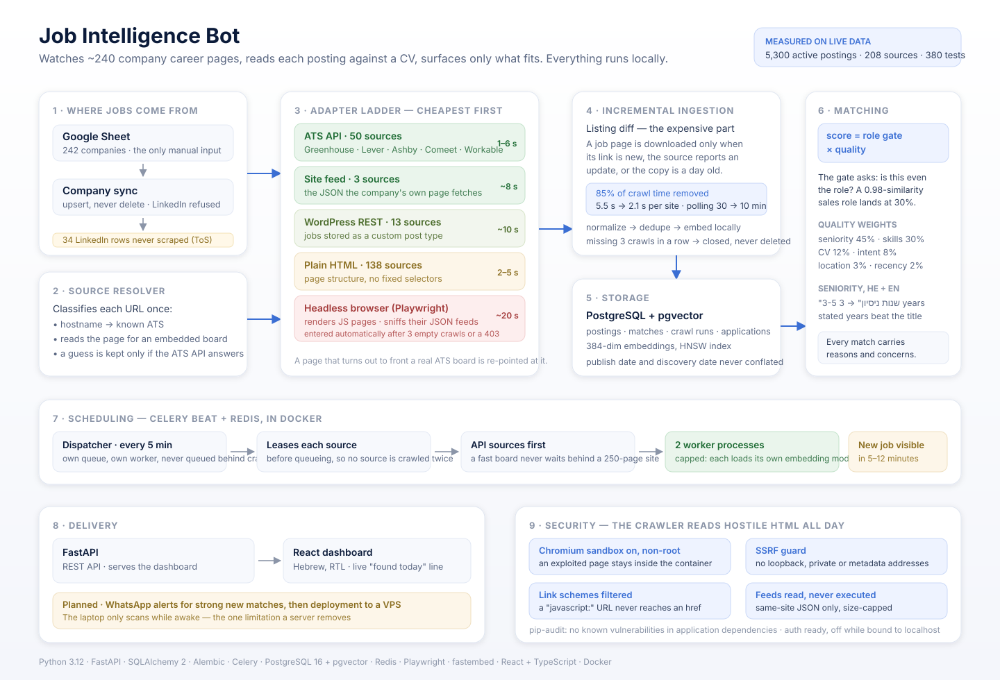

# Job Intelligence Bot

A personal job-search agent. It watches the career pages of ~240 Israeli
tech companies, discovers new postings within minutes of them going up,
reads each one against my CV, and surfaces only what a candidate with my
experience should actually apply to.

It is a single-user system that runs unattended: a FastAPI service, a
Celery worker and scheduler, Postgres with `pgvector`, and a React
dashboard, all in Docker. Everything it needs to score a job runs
locally — embeddings and the LLM included — so there is no API bill and
no CV leaving the machine.



<details>
<summary>The same flow in one line</summary>

```
Google Sheet ─► company sync ─► source resolver ─► 11 source adapters
                                                          │
                            incremental crawl ◄───────────┘
                                   │
            normalize ─► dedupe ─► embed ─► store (Postgres + pgvector)
                                   │
                          hybrid matching engine
                                   │
                   REST API ─► React dashboard ─► (WhatsApp, planned)
```

</details>

> **Status:** phases 1–9 complete and running daily. Phase 7 (WhatsApp
> alerts) and phase 10 (deployment to a VPS) are the remaining work; see
> [Roadmap](#roadmap).

---

## The problem it solves

Job boards are noisy and slow. Postings reach aggregators late, are
duplicated across them, and "junior" filters are unreliable — a posting
titled *Full Stack Developer* that demands "at least 2–3 years, mandatory"
is not a junior role no matter what the filter says.

So this watches the companies themselves, at the source. The hard part
turned out not to be the crawling; it was **deciding what is worth
reading**, in two languages, without drowning in false positives.

---

## What makes it interesting

### 1. An escalation ladder for reading career pages

Every company's careers page is a different problem. Rather than one
brittle scraper, a resolver classifies each URL once and the cheapest
adapter that works handles it. Measured against the real sheet:

| Tier | How jobs are read | Sources | Cost |
|---|---|---|---|
| ATS API | Greenhouse, Lever, Ashby, Comeet, Workable, SmartRecruiters, Workday, Taleo | 50 | 1–6 s |
| Site feed | the JSON the company's own page fetches (Elbit, IAI, Amazon) | 3 | ~8 s |
| WordPress REST | jobs stored as a custom post type | 13 | ~10 s |
| JSON-LD | `schema.org/JobPosting` markup, present for Google for Jobs | 1 | ~3 s |
| Plain HTML | the page's own structure, no fixed selectors | 138 | 2–5 s |
| Headless browser | Playwright, only when everything above found nothing | escalated automatically | ~20 s |

A rendered page is also watched for what it *fetches*: the JSON its own
scripts pull becomes the job list when the HTML has no links to follow,
and a page that calls an ATS's API is re-pointed at that board instead
of being scraped. Picking the right captured document is harder than it
sounds — field names lie (one site's *product cards* carry a
`description` while its postings keep theirs under `AboutTheRole`), so
the test is whether the titles read like job titles. The calibration,
and the two wrong rules that preceded it, are in
[`docs/job_sources.md`](docs/job_sources.md).

Two details I'm happy with:

- **~45 of the "custom" pages turned out to embed a known ATS** behind
  the company's own domain. The resolver reads the page and recognises
  the real board (`COMEET.init({...})`, a Greenhouse embed script, a
  `myworkdayjobs.com` link, an API the page's own JavaScript calls), then
  crawls that board with the adapter that already exists. A guessed board
  token is **never** stored until the ATS's public API answers for it —
  one page still carried a dead Greenhouse embed next to the Ashby board
  it had migrated to, and only the live one is kept.
- **Nothing is configured as "needs a browser".** A plain page that
  returns no job links three successful crawls in a row, or refuses with
  403, is handed to the Playwright adapter automatically and polled
  hourly from then on. The expensive tier is entered by evidence, not by
  guesswork.

### 2. Incremental crawling: 85% of the work was redundant

The first version re-downloaded every job page on every crawl. Profiling
showed plain career sites were 85% of all crawl time, and a full cycle
took two and a half hours — which is why they could only be polled every
30 minutes.

A crawl now downloads a job page only when the link is new, when the
listing reports a newer timestamp, or when the stored copy is older than
`JOB_DETAILS_REFRESH_HOURS`. Everything else is confirmed present from
the listing alone.

| Same sites, before and after | Average | Median | Worst |
|---|---|---|---|
| Re-downloading every page | 5.5 s | 3.2 s | 350 s |
| Listing diff | 2.1 s | 1.7 s | 6 s |

That paid for the polling interval: plain sites went 30 → 10 minutes,
and a new posting now surfaces in about 12 minutes instead of 35.

### 3. Matching that says *why*, and can be wrong out loud

The score is deliberately not one cosine similarity:

```
final = 100 × role_gate × quality
role_gate = 0.2 + 0.8 × role_fit
quality   = 0.45·seniority + 0.30·skills + 0.12·cv_similarity
          + 0.08·intent + 0.03·location + 0.02·recency
```

The **role gate** is the part that matters. A Check Point posting titled
*Agentic AI Solutions Engineer* scores 0.98 on raw CV similarity — the
text is full of AI, LLM, cloud and API — but it is a customer-facing
pre-sales role requiring firewall industry experience. The gate reads the
title and keywords, multiplies everything else by how much the job *is*
the target role, and lands it at 30%. Semantic similarity alone would
have ranked it near the top.

Other decisions that came out of the real data:

- **The local embedding model's raw similarity ranges 0.15–0.55 even for
  perfect matches** and barely separates junior from senior. So it is
  calibrated onto that observed range and weighted lightly; seniority and
  skill overlap carry the score. The weights in `.env` are far from the
  textbook defaults for exactly this reason.
- **Seniority is read in Hebrew and English**, from the requirements
  section rather than the whole description: ranges (`3-5 שנות ניסיון`)
  resolve to their lower bound, Hebrew numerals and spelled-out numbers
  are handled, and "no experience required" phrasings are recognised
  along with their negations (`לא יתקבלו מועמדים ללא ניסיון`).
- **Stated years beat the title.** A posting whose title reads junior but
  which asks for "2–3 years, mandatory" is tagged *requires experience*
  and hidden — the bug that first made this obvious is now a regression
  test.
- Every match carries **reasons** and **concerns** in plain language, so
  a wrong score is debuggable instead of mysterious.

### 4. A scheduler that degrades sensibly

Celery Beat dispatches due sources every 5 minutes. Three things were
learned the hard way and are now documented in code:

- The dispatcher runs on **its own queue** with its own worker. On the
  shared queue it waited behind hundreds of queued crawls after any
  pause, and the "next refresh" countdown ran an hour late.
- Each dispatched source is **leased** (its next check is pushed forward)
  *before* the task is queued, so a slow cycle can't enqueue the same
  source twice and have two workers collide on the uniqueness constraint.
- API-backed sources are dispatched **before** slow ones, so a new job at
  a company with a real API never waits behind a 250-page career site.

### 5. Honest data modelling

`source_published_at` (what the ATS reports) and `first_seen_at` (when
this bot noticed) are kept strictly separate and never substituted for
each other in the UI. A job that disappears from a listing is not deleted
or immediately closed — it must be missing from several consecutive
*successful* crawls first, because a single crawl can omit a job through
a pagination hiccup. Closed jobs keep their history.

---

## Results on real data

Measured on the live database, not a sample:

| | |
|---|---|
| Companies watched | 242 (208 crawlable; LinkedIn URLs are never scraped) |
| Active postings stored | ~5,300, of which ~2,450 confirmed in Israel |
| Crawl runs executed | 13,000+ |
| New postings found per active day | ~2,500 |
| Test suite | 380 tests |

Scoring behaviour, sampled against my own CV: junior developer titles
score a median of 88%, senior titles 12%, unrelated fields 10%.

---

## Running it

Requirements: Docker Desktop, Python 3.12 with [uv](https://docs.astral.sh/uv/),
Node 20 for the dashboard, and [Ollama](https://ollama.com) if you want
LLM-based CV extraction (there is a deterministic fallback without it).

```bash
git clone <this repo> && cd Bot_career
cp .env.example .env            # defaults work for local development

docker compose up -d            # Postgres + Redis + Celery worker + scheduler
uv sync                         # Python dependencies
uv run alembic upgrade head     # schema

cd frontend && npm install && npm run build && cd ..
uv run uvicorn app.main:app --host 127.0.0.1 --port 8000
```

Then open **http://127.0.0.1:8000/app/**, upload a CV on the profile
page, and the crawler fills the dashboard as it goes.

The Celery worker and scheduler run in Linux containers on purpose:
Celery's prefork pool does not work on native Windows, and the browser
fallback needs a Linux Chromium. Only the API process runs on the host
during development.

### Useful commands

```bash
uv run python -m app.cli sync-sheet          # re-import companies
uv run python -m app.cli crawl-now           # crawl everything due, now
uv run python -m app.cli score-all           # rescore every active job
uv run python -m app.cli reassess-seniority  # re-read experience requirements
uv run pytest                                # 380 tests
uv run ruff check . && uv run mypy app tests # lint + types
```

[`docs/operations.md`](docs/operations.md) is the full operator's manual:
how to start it, scheduler internals, the API surface, migrations, and
the environment problems worth knowing about before they cost you an
afternoon — including the one that silently stops every crawl on a
machine with a TLS-inspecting antivirus
([`certs/README.md`](certs/README.md)).

---

## Engineering practices

- **380 tests**, unit and integration, against a real Postgres with
  `pgvector`. Every regression described above has a test named after the
  bug it prevents.
- **`mypy --strict`** over application and test code, `ruff` for lint and
  formatting, both clean.
- **Alembic migrations** for every schema change; no `create_all` in
  production paths.
- **Structured JSON logging** with identifiers rather than payloads, so
  logs stay greppable and carry no secrets.
- **Comments explain decisions, not syntax.** Where a constant looks
  arbitrary, the comment says what was measured to choose it.
- Third-party API formats are **verified against live responses** and
  recorded in `docs/job_sources.md`, including the undocumented Workday
  and Taleo request shapes.

---

## Security

The threat model is specific: this is a single-user tool bound to
localhost whose crawler reads **untrusted third-party HTML** all day. The
review covered input handling, injection, SSRF, XSS, secret handling,
container posture and dependencies.

| Control | How |
|---|---|
| SQL injection | SQLAlchemy Core/ORM throughout; no string-built SQL. The one raw statement is a literal `SELECT 1` health probe. |
| Stored XSS | Crawled URLs become links in the dashboard. Non-`http(s)` schemes (`javascript:`, `data:`) are dropped when a posting is ingested **and** filtered again before anything is rendered as an `href`. |
| SSRF | The crawler refuses URLs whose host is a loopback, private, or link-local literal address — including `169.254.169.254`, the cloud metadata endpoint. |
| Browser isolation | The Playwright fallback renders hostile pages **with Chromium's sandbox enabled**, as a non-root user, with images, media and fonts blocked. |
| Upload handling | Résumés are size-capped while streaming (10 MB), the filename is reduced to its last path component and length-checked, and only PDF/DOCX are parsed. |
| Secrets | `.env`, service-account keys and certificates are git-ignored and have never been committed; logs record error *types*, not payloads. |
| Response hardening | `X-Content-Type-Options`, `X-Frame-Options`, `Referrer-Policy` on every response. No CORS middleware: the dashboard is same-origin, so no other site can call the API. |
| Data exposure | Postgres and Redis publish their ports to `127.0.0.1` only, so a weak local password is never reachable from the network. |
| Dependencies | `pip-audit` reports **no known vulnerabilities** in application dependencies. |
| Authentication | Off by default, which is correct for a service on `127.0.0.1`. Setting `DASHBOARD_PASSWORD` turns on HTTP Basic auth for everything except `/health` — required before this is exposed, and intended to sit behind HTTPS or Tailscale. |

LinkedIn is never scraped. Its User Agreement prohibits automated access,
and `hiQ Labs v. LinkedIn` was decided on contract grounds — so a sheet
row pointing at LinkedIn is marked unsupported with a reason rather than
silently crawled. Crawling is polite: bounded timeouts, retries with
exponential backoff and jitter on transient failures only, and no retry
storms against a site returning 4xx.

---

## Limitations

Stated plainly, because they are design choices rather than oversights:

- **It only runs while the machine is awake.** A laptop asleep overnight
  scans nothing. This is what phase 10 (a small VPS) fixes.
- **Some sites cannot be read at all.** Enterprise bot-management (Akamai,
  Imperva) refuses the headless browser too. Those sources fail visibly on
  the status page rather than silently returning nothing.
- **Roughly a quarter of postings say nothing readable about experience.**
  They are tagged "unspecified" in grey rather than guessed at.
- **The local embedding model is weaker than a hosted one.** That is the
  price of keeping a CV on the machine, and the scoring weights are
  calibrated around it instead of pretending otherwise.

---

## Roadmap

| Phase | Status |
|---|---|
| 1–6 — schema, CV pipeline, company sync, ingestion, matching, scheduling | done |
| 8 — remaining adapters, embedded-board detection, browser fallback | done |
| 9 — React dashboard, applications pipeline, live status | done |
| Security review | done |
| 7 — WhatsApp alerts for strong new matches | next |
| 10 — VPS deployment, CI/CD, backups, rate limiting | planned |

---

## Project layout

```
app/
  api/routes/      FastAPI endpoints
  core/            config, logging, security, timezone
  db/              engine and session
  models/          SQLAlchemy models
  schemas/         Pydantic request/response types
  services/
    candidate/     CV parsing and structured extraction
    jobs/          ingestion, normalization, location
    matching/      scoring, seniority, skills, queries
    sheets/        company sync
  ingestion/
    resolver.py    URL ─► source type classification
    adapters/      one module per job source
  tasks/           Celery app, scheduler, crawl tasks
frontend/          React + TypeScript dashboard (Vite)
tests/             unit and integration tests
docs/              architecture, job sources, matching, dashboard
alembic/           migrations
```

Further reading: [`docs/architecture.md`](docs/architecture.md) for the
design, [`docs/job_sources.md`](docs/job_sources.md) for the verified ATS
formats and what each real site turned out to need,
[`docs/matching.md`](docs/matching.md) for the scoring model,
[`docs/dashboard.md`](docs/dashboard.md) for the UI, and
[`docs/operations.md`](docs/operations.md) for running it.
